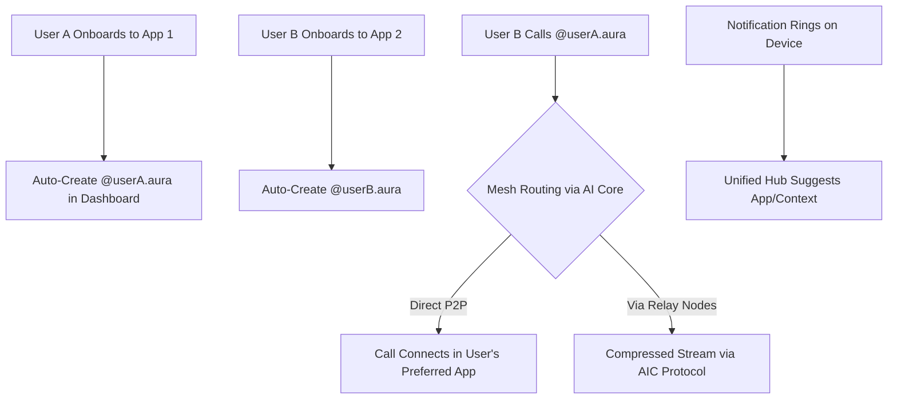
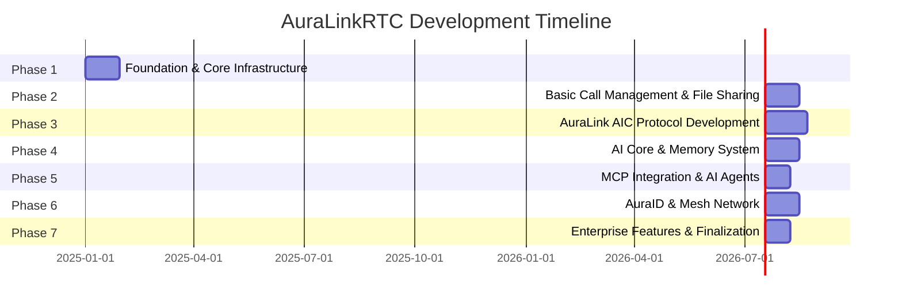

# 🚀 AuraLink Development Master Plan

> **AuraLinkRTC Inc.** - Comprehensive 7-Phase Development Roadmap for Intelligent Real-Time Communication Platform

## 📋 Executive Summary

This document outlines a comprehensive 7-phase development plan for AuraLinkRTC, a proprietary WebRTC platform with cutting-edge AI integration. The plan focuses on backend development, starting with core infrastructure and progressively building advanced features. Each phase is designed to deliver functional components that build upon previous work, creating a robust, scalable system for intelligent real-time communication.

The development approach follows a microservice architecture with five core services:
1. **WebRTC Server** (media handling)
2. **AI Core** (intelligence)
3. **Dashboard Service** (API/management)
4. **Ingress/Egress** (external media)
5. **Communication Service** (cross-app calling and messaging)

This plan details the systematic development of these services, integration of AI capabilities, and implementation of the innovative AuraLink AIC Protocol for optimized media compression.

---

## 🌟 Phase 1: Foundation & Core Infrastructure 

### Objective
Establish the fundamental infrastructure by forking LiveKit, Matrix, and Jitsi, and setting up the core microservices architecture with basic functionality.

### Key Deliverables

#### ✅ Completed (as of 2025-10-15)

- **Microservice Scaffolding**: Created `auralink-webrtc-server/`, `auralink-ai-core/`, `auralink-dashboard-service/`, `auralink-ingress-egress/`, and `auralink-communication-service/` directories following the micro-repo structure.
- **LiveKit Fork**: Cloned `https://github.com/livekit/livekit` into `auralink-webrtc-server/` for WebRTC Server development.
- **Matrix Fork (AuraID/Communication)**: Cloned `https://github.com/matrix-org/synapse` (tag `v1.98.0`) into `auralink-communication-service/` to power AuraID federation features.
- **Matrix Fork (Federated ID Workspace)**: Cloned `https://github.com/matrix-org/synapse` into `Auralink-FederatedID/` for dedicated AuraID customization.
- **Jitsi Videobridge**: Cloned `https://github.com/jitsi/jitsi-videobridge` into `auralink-ingress-egress/` for media ingress/egress handling.
- **Jitsi Conference Focus**: Cloned `https://github.com/jitsi/jicofo` into `auralink-ingress-egress/jicofo` to support external media coordination.

#### 🔄 Remaining Tasks for Phase 1

##### 1. Fork and Customize Open Source Components (Completed)

- ✅ Implement base AuraLink-specific configuration across cloned services (branding, env templates, shared configs).
- ✅ Set up shared development environment tooling and automated testing scaffold.
- ✅ Define configuration flags for future AIC Protocol integration within `auralink-webrtc-server/`.

##### 2. Database Infrastructure Setup (Not Started)

- ✅ Provision Supabase PostgreSQL database and establish the core schema.
- ✅ Create baseline tables: `calls`, `call_participants`, `contacts`, `quality_issues`, `quality_alerts`.
- ✅ Configure Row Level Security (RLS) policies for multi-tenant isolation.
- ✅ Deploy Redis instance and wire initial caching layer for real-time data paths.

##### 3. Core Microservices Architecture (Completed)

- ✅ Establish five microservice workspaces aligned with the micro-repo plan.
- ✅ Wire Matrix clone for AuraID federation (`auralink-communication-service/`).
- ✅ Integrate Jicofo clone into ingress/egress workspace.
- ✅ Implement initial service mesh configuration (Istio/Linkerd) and inter-service routing.
- ✅ Author Kubernetes deployment manifests and Helm charts in `infrastructure/kubernetes/`.
- ✅ Create initial integration endpoints between WebRTC, AI Core, Dashboard, Ingress/Egress, and Communication services.

##### 4. Error Handling & Resilience Framework (Completed)

- ✅ Define error handling patterns and shared middleware for Go/Python services.
- ✅ Implement circuit breaker policies for cross-service calls.
- ✅ Add retry/backoff utilities and resilience helpers in `shared/libs/`.
- ✅ Outline graceful degradation scenarios and fallback service strategies.
- ✅ Plan comprehensive logging, alerting, and dead-letter queue handling.
- ✅ Document health check and readiness endpoints per service.

##### 6. Monitoring & Observability Framework (Completed)

- ✅ Stand up Prometheus/Grafana stack definitions under `infrastructure/monitoring/`.
- ✅ Configure Jaeger tracing and Loki logging stack integration.
- ✅ Draft service-specific health/readiness probes and custom metrics.
- ✅ Establish alerting rules and incident response pathways.
- ✅ Prepare operational dashboards for DevOps visibility.

### Technical Implementation Details
```go
// Example configuration for WebRTC Server (Go)
type AuraLinkConfig struct {
    EnableAIC bool `json:"enable_aic"`
    MaxParticipants int `json:"max_participants"`
    TurnServers []string `json:"turn_servers"`
    RedisURL string `json:"redis_url"`
    DatabaseURL string `json:"database_url"`
    SupabaseURL string `json:"supabase_url"`
    SupabaseAnonKey string `json:"supabase_anon_key"`
    SupabaseServiceRoleKey string `json:"supabase_service_role_key"`
}

// Example Supabase authentication integration
func InitializeSupabaseAuth() (*supabase.Client, error) {
    supabaseUrl := os.Getenv("SUPABASE_URL")
    anonKey := os.Getenv("SUPABASE_ANON_KEY")
    
    client, err := supabase.NewClient(supabaseUrl, anonKey, &supabase.ClientOptions{})
    if err != nil {
        return nil, err
    }
    
    return client, nil
}

// Example user authentication flow
func AuthenticateUser(email, password string) (*supabase.User, error) {
    client := InitializeSupabaseAuth()
    auth := client.Auth
    
    user, err := auth.SignIn(supabase.UserCredentials{
        Email:    email,
        Password: password,
    })
    
    return user, err
}
```

### Integration Points
- WebRTC Server connects to Redis for real-time state and error handling
- Dashboard Service connects to PostgreSQL for persistent data and monitoring
- Basic health check endpoints between services with comprehensive error reporting
- Kubernetes orchestration for service deployment with monitoring integration
- Error handling and monitoring frameworks integrated across all microservices

### Why This Phase Matters
This phase establishes the foundation for all future development. By forking LiveKit, we leverage a proven WebRTC implementation while preparing for our custom enhancements. The microservice architecture ensures scalability and separation of concerns, while the database infrastructure provides a solid data layer for all operations.

---

## 🌐 Phase 2: Basic Call Management & File Sharing 

### Objective
Extend and customize the forked components to implement core WebRTC functionality for audio/video calls, screen sharing, and file exchange during calls.

### Key Deliverables

#### 1. WebRTC Core Features (Extending LiveKit)
- Customize LiveKit's existing SFU for AuraLink-specific requirements
- Extend cross-platform WebRTC capabilities with AuraLink branding and features
- Enhance LiveKit's adaptive quality system for AuraLink's specific use cases
- Configure multi-region clustering with Redis backend for AuraLink deployment
- Optimize TURN/STUN server configuration for AuraLink's reliability requirements

##### Original Project References
- **LiveKit Server**: [https://github.com/livekit/livekit](https://github.com/livekit/livekit) (Main SFU implementation)
- **Matrix Homeserver**: [https://github.com/matrix-org/synapse](https://github.com/matrix-org/synapse) (Federation and identity server)
- **Jitsi Videobridge (JVB)**: [https://github.com/jitsi/jvb](https://github.com/jitsi/jvb) (Backend media routing)
- **Jitsi Conference Focus (Jicofo)**: [https://github.com/jitsi/jicofo](https://github.com/jitsi/jicofo) (Backend conference management)

#### 2. Call Management System
- Implement room creation and management
- Develop participant tracking and presence
- Create call recording capabilities
- Implement screen sharing functionality
- Develop quality monitoring system

#### 3. File Sharing Implementation
- Create file upload/download during calls
- Implement chunked file transfer for large files
- Set up file metadata storage in database
- Implement file preview capabilities
- Configure virus scanning for shared files

#### 4. Link Sharing System
- Develop shareable call links
- Implement short code generation
- Create access controls for links
- Develop link analytics and tracking
- Implement link expiration functionality

### Technical Implementation Details
```sql
-- Example database schema for file sharing
CREATE TABLE IF NOT EXISTS files (
    file_id VARCHAR(50) PRIMARY KEY,
    call_id VARCHAR(50) REFERENCES calls(call_id) ON DELETE SET NULL,
    room_name VARCHAR(255) NOT NULL,
    uploader_identity VARCHAR(255) NOT NULL,
    file_name VARCHAR(255) NOT NULL,
    file_size BIGINT NOT NULL,
    storage_path TEXT NOT NULL,
    download_url TEXT,
    created_at TIMESTAMPTZ DEFAULT NOW()
);
```

### Integration Points
- WebRTC Server handles media streams and file transfer
- Dashboard Service manages link creation and tracking
- Ingress/Egress Service handles file storage and delivery
- Database stores file metadata and link information

### Why This Phase Matters
This phase delivers the core communication functionality that users expect. By implementing robust call management, we ensure reliable audio/video communication. File sharing enhances collaboration during calls, while link sharing makes it easy for users to invite others to calls. These features form the essential user experience foundation.

---

## 🤖 Phase 3: AuraLink AIC Protocol Development 

### Objective
Develop and integrate the proprietary AuraLink AIC Protocol for AI-driven WebRTC compression, reducing bandwidth by 80% for 4K on low-bandwidth networks.

### Key Deliverables

#### 1. AIC Protocol Core Development
- Research and implement neural codec algorithms
- Develop RTP extension hooks for AI metadata
- Create compression ratio prediction system
- Implement adaptive bitrate based on AI hints
- Develop fallback mechanisms for reliability

#### 2. AI Compression Engine
- Implement EnCodec-inspired neural compression
- Create frame analysis and prediction system
- Develop dynamic adaptation based on network conditions
- Implement codec switching based on available bandwidth
- Create performance monitoring system

#### 3. Integration with WebRTC Server
- Extend RTP/RTCP in WebRTC Server for AIC Protocol
- Implement intercept points for media streams
- Create AI hint injection system
- Develop compression application logic
- Implement A/B testing framework

#### 4. Testing and Optimization
- Create benchmark suite for compression performance
- Implement latency testing framework
- Develop bandwidth savings measurement
- Create quality assessment tools
- Implement optimization feedback loop

### Technical Implementation Details
```go
// Example AIC Protocol integration in WebRTC Server
func CompressWithAIC(stream RTPStream) RTPStream {
    if !config.EnableAIC {
        return stream // Pass through if AIC disabled
    }
    
    // Get AI hints for compression
    hints := grpc.Call("AICompress", stream.Frame)
    
    // Apply compression based on hints
    stream.Frame = ApplyCompression(stream.Frame, hints)
    
    // Add metadata to RTP extension
    metadata := AICMetadata{
        CompressionRatio: hints.Ratio,
        Timestamp: time.Now().UnixNano()
    }
    stream.RTP.Extensions = append(stream.RTP.Extensions, metadata)
    
    return stream
}
```

### Integration Points
- WebRTC Server sends frames to AI Core for analysis
- AI Core returns compression hints via gRPC
- WebRTC Server applies compression based on hints
- Dashboard Service provides toggle for AIC Protocol

### Why This Phase Matters
The AuraLink AIC Protocol is our key differentiator, enabling high-quality video on low-bandwidth connections. By reducing bandwidth requirements by 80%, we enable 4K video where competitors can only deliver 1080p. This proprietary technology creates significant competitive advantage and enhances user experience, especially in regions with limited connectivity.

---

## 🧠 Phase 4: AI Core & Memory System 

### Objective
Implement the AI Core microservice with memory capabilities, enabling intelligent features like real-time translation, speech-to-text, and text-to-speech.

### Key Deliverables

#### 1. AI Core Microservice Development
- Set up Python/FastAPI service architecture
- Implement async processing for real-time AI
- Create model serving infrastructure with BentoML or KServe for scalable model serving
- Develop API endpoints for AI features
- Implement monitoring and logging
- Integrate Temporal for durable AI workflow orchestration
- Set up workflow retry mechanisms and state management for long-running AI tasks

#### 2. Memory System Implementation
- Adapt SuperMemory.ai architecture for AuraLink
- Implement the Connect→Ingest→Embed→Index→Recall→Evolve pipeline
- Create vector database for semantic search with Pinecone integration
- Implement graph database for relationship tracking
- Develop memory persistence and retrieval system
- Integrate Ray for distributed inference and semantic search optimization

#### 3. Speech Processing Features
- Implement Speech-to-Text (STT) with multiple provider options
- Develop Text-to-Speech (TTS) with voice customization
- Create real-time translation for 10+ languages
- Implement noise cancellation for audio
- Develop searchable archives for transcriptions

#### 4. AI Provider Integration
- Implement BYOK (Bring Your Own Keys) support
- Create provider switching logic
- Develop usage tracking and billing
- Implement fallback mechanisms
- Create provider-specific optimizations

### Technical Implementation Details
```python
# Example AI Core memory system in Python/FastAPI
class MemorySystem:
    def __init__(self):
        self.vector_db = VectorDatabase()
        self.graph_db = GraphDatabase()
    
    async def store_memory(self, user_id, content, context):
        # Process and clean data
        cleaned_data = self.preprocess(content)
        
        # Generate embeddings
        embeddings = self.embed(cleaned_data)
        
        # Store in vector database for semantic search
        vector_id = await self.vector_db.store(user_id, embeddings)
        
        # Store in graph database for relationships
        graph_id = await self.graph_db.store(user_id, context)
        
        # Link the two storage systems
        await self.link_memories(vector_id, graph_id)
        
        return {"memory_id": vector_id}
    
    async def recall(self, user_id, query, limit=5):
        # Generate query embedding
        query_embedding = self.embed(query)
        
        # Search vector database
        results = await self.vector_db.search(user_id, query_embedding, limit)
        
        # Enrich with graph context
        enriched_results = await self.enrich_with_context(results)
        
        return enriched_results
```

### Integration Points
- AI Core connects to WebRTC Server for media processing
- Memory system integrates with Dashboard for user preferences
- AI Core provides APIs for all microservices
- Database stores AI usage and memory data

### Why This Phase Matters
The AI Core is the intelligence layer of our platform, enabling features that transform communication from simple media exchange to intelligent interaction. The memory system provides persistence and context, allowing AI to remember past interactions and personalize experiences. By integrating enterprise-grade workflow orchestration tools like Temporal and advanced AI frameworks like BentoML/KServe and Ray, we ensure scalable, fault-tolerant AI processing. These capabilities enable our differentiating features like real-time translation, transcription, and AI-assisted communication with production-grade reliability.

---

## 🔌 Phase 5: MCP Integration & AI Agents 

### Objective
Integrate Model Context Protocol (MCP) servers and implement AI agents for enhanced intelligence and programmable workflows.

### Key Deliverables

#### 1. MCP Server Integration
- Implement DeepWiki MCP for real-time GitHub/docs access
- Integrate Memory MCP for graph-based recall
- Implement Sequential-Thinking MCP for step-by-step reasoning
- Integrate Supabase MCP for live database queries
- Create MCP management system
- Set up Prefect for dynamic MCP workflow orchestration and adaptive processing

#### 2. AI Agent Framework
- Develop agent creation and management system
- Implement custom prompt and behavior configuration
- Create workflow automation for agents
- Develop agent memory integration
- Implement real-time talkback capabilities
- Integrate LangGraph for stateful, multi-step AI agents with graph-based reasoning
- Implement CrewAI for role-based AI agent teams and collaborative workflows
- Add AutoGen for multi-agent conversations and collaborative problem-solving

#### 3. Agent Workflows
- Create auto-join room functionality
- Implement contextual response system
- Develop summarization workflows
- Create moderation workflows
- Implement Q&A capabilities

#### 4. Multiple LLM Selection
- Implement provider selection interface
- Create model switching logic
- Develop BYOK for custom models
- Implement performance comparison tools
- Create cost optimization system

### Technical Implementation Details
```javascript
// Example agent workflow definition
const agentWorkflow = {
  name: "Meeting Assistant",
  triggers: [
    { type: "room_join", action: "greet_participants" },
    { type: "question_detected", action: "answer_question" },
    { type: "meeting_end", action: "generate_summary" }
  ],
  memory: {
    use_persistent: true,
    context_window: 10000,
    mcp_connections: ["memory", "sequential-thinking"]
  },
  llm_config: {
    primary_model: "gpt-4",
    fallback_model: "claude-2",
    temperature: 0.7,
    max_tokens: 2000
  }
};
```

### Integration Points
- AI Core connects to MCP servers for enhanced capabilities
- Dashboard Service provides agent management interface
- WebRTC Server routes agent media to calls
- Database stores agent configurations and workflows
- Temporal orchestrates durable AI workflows across all services
- LangGraph, CrewAI, and AutoGen power advanced multi-agent interactions
- Prefect manages dynamic workflow adaptations based on runtime conditions

### Why This Phase Matters
MCP integration significantly enhances our AI capabilities by connecting to specialized external tools and data sources. AI agents make these capabilities actionable, providing automated assistance in calls. By integrating advanced AI frameworks like LangGraph for stateful reasoning, CrewAI for team-based collaboration, and AutoGen for multi-agent conversations, we enable sophisticated AI interactions. Prefect provides dynamic workflow orchestration that adapts to runtime conditions, while Temporal ensures durable execution across service boundaries. Together, these tools enable use cases like real-time research assistance, intelligent meeting facilitation, and automated customer support with enterprise-grade reliability. This phase transforms our platform from a communication tool to an intelligent collaboration assistant powered by cutting-edge AI orchestration.

---

## 🔗 Phase 6: AuraID & Mesh Network 

### Objective
Fully implement the AuraID universal identity layer and mesh network capabilities for decentralized, peer-to-peer communication, leveraging the previously forked Matrix and Jitsi components.

### Key Deliverables

#### 1. AuraID System
- Complete the universal ID structure (@username.aura) using Matrix's federation capabilities
- Enhance ID creation and management with Matrix's identity server features
- Create identity verification system
- Develop privacy controls
- Implement cross-app identity resolution

#### 2. Communication Service Integration
- Develop cross-app calling and messaging APIs
- Implement unified hub for app-to-app communication
- Create notification system for cross-app interactions
- Develop bridge protocols for seamless messaging
- Integrate AuraID for persistent cross-app identity

#### 3. Mesh Network Infrastructure
- Implement peer-to-peer routing using Jitsi's P2P capabilities
- Develop AI-optimized path selection
- Create fallback mechanisms for reliability
- Implement node discovery and management
- Develop security measures for mesh integrity

#### 3. Federated Trust System
- Implement reputation system for nodes
- Create abuse prevention mechanisms
- Develop rate limiting for security
- Implement privacy protections
- Create audit logging for security events

#### 4. Enhanced Matrix & Jitsi Integration
- Complete customization of Matrix federation for AuraID
- Finalize Jitsi integration for video call enhancements
- Implement unified notification system
- Create cross-app communication bridges
- Develop seamless user experience across platforms

##### Original Project References for Phase 6 Integration
- **Matrix Homeserver**: [https://github.com/matrix-org/synapse](https://github.com/matrix-org/synapse) (Federation capabilities)
- **Jitsi Videobridge (JVB)**: [https://github.com/jitsi/jvb](https://github.com/jitsi/jvb) (Backend P2P media routing)
- **Jitsi Conference Focus (Jicofo)**: [https://github.com/jitsi/jicofo](https://github.com/jitsi/jicofo) (Backend conference management)

### Technical Implementation Details


### Integration Points
- Dashboard Service manages AuraID creation and verification
- WebRTC Server handles mesh network routing
- AI Core optimizes path selection
- Matrix fork provides federation capabilities

### Why This Phase Matters
AuraID transforms our platform from a traditional WebRTC service to a universal communication layer. By creating a persistent identity that works across applications, we eliminate silos and enable seamless communication. The mesh network architecture improves scalability by leveraging user devices for routing, reducing server costs and improving performance. Together, these features position AuraLinkRTC as the "TCP/IP of WebRTC" - a fundamental protocol for real-time communication.

---

## 🏢 Phase 7: Enterprise Features & Finalization 

### Objective
Implement enterprise-grade features for compliance, security, analytics, and administration, finalizing the platform for production use.

### Key Deliverables

#### 1. Enterprise Security & Compliance
- Implement SSO integration (SAML/OAuth)
- Create audit logging system
- Develop data retention policies
- Implement GDPR/HIPAA compliance features
- Create security event monitoring

#### 2. Advanced Analytics
- Develop real-time metrics dashboard
- Create call quality analytics
- Implement AI usage tracking
- Develop cost optimization insights
- Create custom report generation

#### 3. Administration System
- Implement role-based access control with Casbin for fine-grained permissions
- Create organization management
- Develop user management
- Implement policy enforcement
- Create billing and subscription management
- Integrate Apache Airflow for scheduled batch processing and analytics workflows
- Set up Argo Workflows for Kubernetes-native batch AI processing and recording analysis

#### 4. Performance Optimization & Scaling
- Implement horizontal scaling for all services
- Create global CDN integration
- Develop load balancing improvements with Kong API Gateway for centralized routing
- Implement caching optimizations with Redis clustering
- Create performance monitoring system
- Deploy Argo Workflows for parallel AI task processing in Kubernetes
- Optimize database connections with pgx connection pooling for Supabase

### Technical Implementation Details
```sql
-- Example enterprise tables
CREATE TABLE IF NOT EXISTS sso_configs (
    config_id VARCHAR(50) PRIMARY KEY,
    organization_id VARCHAR(50) NOT NULL,
    provider_type VARCHAR(20) NOT NULL,
    config_data JSONB NOT NULL,
    created_at TIMESTAMPTZ DEFAULT NOW(),
    updated_at TIMESTAMPTZ DEFAULT NOW()
);

CREATE TABLE IF NOT EXISTS audit_logs (
    log_id VARCHAR(50) PRIMARY KEY,
    organization_id VARCHAR(50) NOT NULL,
    user_id VARCHAR(255),
    action VARCHAR(100) NOT NULL,
    resource_type VARCHAR(50),
    resource_id VARCHAR(255),
    metadata JSONB,
    ip_address VARCHAR(45),
    user_agent TEXT,
    created_at TIMESTAMPTZ DEFAULT NOW()
);
```

### Integration Points
- Dashboard Service provides enterprise management interface
- All services connect to audit logging system
- Analytics data flows from all services to dashboard
- SSO integrates with authentication system

### Why This Phase Matters
Enterprise features are essential for adoption by large organizations, which represent our highest-value customers. Compliance features ensure our platform meets regulatory requirements in industries like healthcare and finance. Advanced analytics provide insights for both us and our customers to optimize performance and costs. By integrating Apache Airflow for scheduled batch processing and Argo Workflows for Kubernetes-native AI task execution, we enable efficient background processing without impacting real-time performance. Kong API Gateway provides centralized routing and rate limiting, while Casbin ensures fine-grained access control. Administration features enable organizations to manage users and policies at scale. Together, these features complete our platform and make it production-ready for enterprise deployment with industry-leading workflow orchestration and security.

---

## 📊 Development Timeline Overview



## 🔄 Dependencies & Critical Path

1. **Phase 1** → **Phase 2**: Core infrastructure must be stable before implementing call features
2. **Phase 2** → **Phase 3**: Basic WebRTC functionality needed before AIC Protocol integration
3. **Phase 3** → **Phase 4**: AIC Protocol provides optimization for AI Core features
4. **Phase 4** → **Phase 5**: Memory system required for MCP integration and AI agents
5. **Phase 5** → **Phase 6**: AI capabilities needed for mesh network optimization
6. **All Phases** → **Phase 7**: Enterprise features integrate with all previous components including error handling and monitoring frameworks

## 🛠️ Resource Requirements

- **Development Team**: 5-7 engineers (2 Go, 2 Python/AI, 1 DevOps, 1-2 Full-stack)
- **Infrastructure**: Kubernetes cluster, Supabase, Redis, Vector database (Pinecone), Prometheus, Grafana, Jaeger, ELK stack
- **Workflow Orchestration**: Temporal, Apache Airflow, Prefect, Argo Workflows
- **AI Frameworks**: LangGraph, CrewAI, AutoGen, BentoML/KServe, Ray
- **External Services**: OpenAI API, ElevenLabs, cloud providers, PagerDuty, Slack
- **Testing Resources**: Load testing environment, network simulation tools, monitoring dashboards, Testcontainers

## 🎯 Success Metrics

- **Performance**: <50ms latency, 80% bandwidth reduction with AIC Protocol
- **Scalability**: Support for 10,000+ concurrent users
- **Reliability**: 99.9% uptime, automatic failover, enterprise-grade error handling
- **Security**: End-to-end encryption, compliance certification
- **Observability**: Comprehensive monitoring with Prometheus/Grafana, <5min incident detection
- **User Experience**: Seamless cross-app communication via AuraID

---

## 🚀 Conclusion

This comprehensive 7-phase development plan provides a clear roadmap for building AuraLinkRTC from foundation to enterprise-ready platform. By focusing on our core differentiators—the AuraLink AIC Protocol, AI integration, and universal identity—we create a unique offering in the WebRTC space.

Each phase builds upon the previous ones, delivering incremental value while progressing toward our vision of a decentralized, AI-augmented communication fabric. The modular microservice architecture ensures scalability and maintainability, while our innovative features provide significant competitive advantages.

By forking and extending LiveKit, Matrix, and Jitsi from the beginning of our development process, we leverage proven open-source components while adding our proprietary enhancements. This approach significantly accelerates development while allowing us to create a unique, enterprise-grade platform that revolutionizes real-time communication through intelligent, bandwidth-efficient, and seamless experiences.

**Enterprise-Grade Technology Stack**: Our platform integrates industry-leading tools including Temporal for durable workflow orchestration, LangGraph and CrewAI for advanced AI agent collaboration, Apache Airflow and Argo Workflows for batch processing, and comprehensive monitoring with Prometheus/Grafana. These technologies ensure production-ready reliability, scalability, and maintainability at enterprise scale.

*© 2025 AuraLinkRTC Inc. All rights reserved.*
