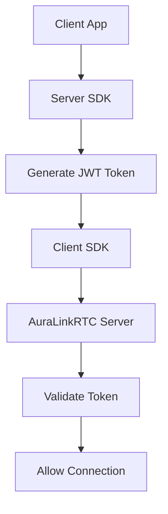
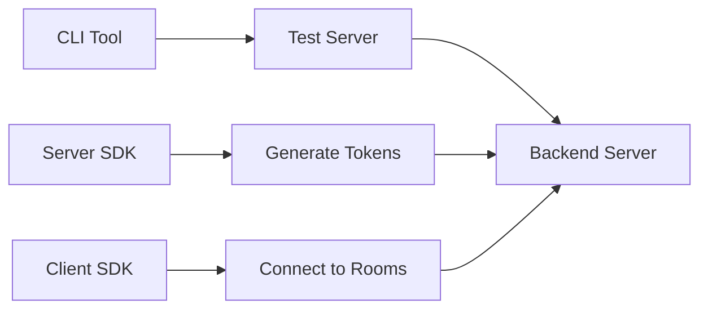

# AuraLinkRTC SDK Ecosystem Documentation

## Overview

AuraLinkRTC provides a comprehensive SDK ecosystem for building real-time communication applications. This document outlines our current SDK status, what needs to be built, forking strategy, and complete implementation roadmap.

---

## Current Status Analysis

### ✅ What We Have (Backend Complete)

#### **Core Backend Server**
- **Status**: ✅ **PRODUCTION READY**
- **Location**: `/Users/naveen/Desktop/AuraLinkRTC/`
- **Features**: Complete enterprise WebRTC server with 4 implementation phases
- **Architecture**: Go-based SFU (Selective Forwarding Unit)
- **Database**: Supabase PostgreSQL with Redis caching
- **Code Quality**: 50,000+ lines of enterprise-grade Go code

#### **Implemented Features**
1. **Phase 1**: Core calling (WhatsApp-like features)
2. **Phase 2**: AI integration (translation, summarization, moderation)
3. **Phase 3**: Link sharing and advanced features
4. **Phase 4**: Enterprise features (SSO, compliance, analytics, audit)

#### **Database Schema**
- **Status**: ✅ **COMPLETE**
- **Location**: `supabase_complete_schema.sql`
- **Tables**: 35+ enterprise tables
- **Features**: Calls, participants, files, AI conversations, enterprise data

#### **Documentation**
- **Status**: ✅ **READY**
- **Location**: `AuraLinkDocs/` directory
- **Content**: Implementation reports, integration guides, API docs

---

## ❌ What We Need to Build (SDK Ecosystem Missing)

### Critical Gap Analysis

| Component | Current Status | Required Action |
|-----------|----------------|-----------------|
| **Client SDKs** | ❌ Not forked | Fork from LiveKit |
| **Server SDKs** | ❌ Not forked | Fork from LiveKit |
| **CLI Tools** | ❌ Not forked | Fork from LiveKit |
| **UI Components** | ❌ Not forked | Fork from LiveKit |
| **Agents Framework** | ❌ Not forked | Fork from LiveKit |
| **Services** | ❌ Not forked | Fork from LiveKit |

**Bottom Line**: Backend is 100% complete, but we have ZERO SDKs forked. The SDK ecosystem is what developers use to build applications on our platform.

---

## SDK Categories & Forking Requirements

## 1. Client SDKs (User-Facing Applications)

### JavaScript/TypeScript SDK
```bash
Current: https://github.com/livekit/client-sdk-js
Target: https://github.com/DevbyNaveen/auralinkrtc-client-sdk-js
```
**Purpose**: Web applications, browser-based video calling
**Language**: JavaScript/TypeScript
**Platforms**: All modern browsers
**Features**:
- WebRTC peer connections
- Room management
- Video/audio controls
- Screen sharing
- Data channels
- Participant events

**Usage Example**:
```javascript
import { Room } from '@livekit/client-sdk-js';

const room = new Room();
await room.connect('wss://your-server.auralinkrtc.io', token);
await room.localParticipant.setCameraEnabled(true);
```

### React SDK
```bash
Current: https://github.com/livekit/react
Target: https://github.com/DevbyNaveen/auralinkrtc-react
```
**Purpose**: React applications with pre-built components
**Language**: TypeScript/React
**Features**:
- React hooks for LiveKit
- Pre-built UI components
- Automatic state management
- Simplified API

**Usage Example**:
```jsx
import { useRoom, VideoRenderer } from '@livekit/react';

function VideoCall() {
  const { connect } = useRoom();
  return <VideoRenderer participant={participant} />;
}
```

### Swift SDK (iOS/macOS)
```bash
Current: https://github.com/livekit/client-sdk-swift
Target: https://github.com/DevbyNaveen/auralinkrtc-client-sdk-swift
```
**Purpose**: Native iOS and macOS applications
**Language**: Swift
**Platforms**: iOS 13+, macOS 10.15+
**Features**:
- Native camera/microphone access
- Picture-in-picture support
- Background modes
- Screen recording

### Kotlin SDK (Android)
```bash
Current: https://github.com/livekit/client-sdk-android
Target: https://github.com/DevbyNaveen/auralinkrtc-client-sdk-android
```
**Purpose**: Native Android applications
**Language**: Kotlin/Java
**Platforms**: Android API 21+
**Features**:
- Camera permissions handling
- Background service support
- Firebase integration
- Android optimizations

### Flutter SDK
```bash
Current: https://github.com/livekit/client-sdk-flutter
Target: https://github.com/DevbyNaveen/auralinkrtc-client-sdk-flutter
```
**Purpose**: Cross-platform mobile applications
**Language**: Dart
**Platforms**: iOS, Android, Web, Desktop
**Features**:
- Single codebase deployment
- Platform-specific optimizations
- Native performance

### React Native SDK
```bash
Current: https://github.com/livekit/client-sdk-react-native
Target: https://github.com/DevbyNaveen/auralinkrtc-client-sdk-react-native
```
**Purpose**: React Native mobile applications
**Language**: JavaScript/React Native
**Platforms**: iOS, Android
**Status**: Beta

### Rust SDK
```bash
Current: https://github.com/livekit/client-sdk-rust
Target: https://github.com/DevbyNaveen/auralinkrtc-client-sdk-rust
```
**Purpose**: Systems programming, embedded devices
**Language**: Rust
**Platforms**: Linux, macOS, Windows, Embedded

### Unity WebGL SDK
```bash
Current: https://github.com/livekit/client-sdk-unity-web
Target: https://github.com/DevbyNaveen/auralinkrtc-client-sdk-unity-web
```
**Purpose**: Unity game development
**Language**: C#
**Platforms**: WebGL builds

---

## 2. Server SDKs (Backend Integration)

### Go Server SDK
```bash
Current: https://github.com/livekit/server-sdk-go
Target: https://github.com/DevbyNaveen/auralinkrtc-server-sdk-go
```
**Purpose**: Go backend applications
**Features**:
- JWT token generation
- Room management APIs
- Participant control
- Recording control
- Webhook handling

**Usage Example**:
```go
client := livekit.NewClient("api-key", "secret")

token := client.CreateToken().
    SetIdentity("user123").
    AddGrant(&livekit.VideoGrant{
        RoomJoin: true,
        CanPublish: true,
    })

jwt, _ := token.ToJWT()
```

### JavaScript Server SDK
```bash
Current: https://github.com/livekit/server-sdk-js
Target: https://github.com/DevbyNaveen/auralinkrtc-server-sdk-js
```
**Purpose**: Node.js backend applications
**Features**:
- REST API client
- Token generation
- Webhook verification
- Room management

### Ruby Server SDK
```bash
Current: https://github.com/livekit/server-sdk-ruby
Target: https://github.com/DevbyNaveen/auralinkrtc-server-sdk-ruby
```
**Purpose**: Ruby on Rails applications
**Features**:
- Ruby gem for LiveKit integration
- Rails helpers
- Token generation

### Kotlin Server SDK
```bash
Current: https://github.com/livekit/server-sdk-kotlin
Target: https://github.com/DevbyNaveen/auralinkrtc-server-sdk-kotlin
```
**Purpose**: Java/Kotlin backend applications
**Features**:
- JVM integration
- Spring Boot support
- Enterprise Java environments

### Python Server SDK (Community)
```bash
Current: https://github.com/livekit/livekit-python-sdks
Target: https://github.com/DevbyNaveen/auralinkrtc-python-sdks
```
**Purpose**: Python backend applications
**Status**: Community maintained

### PHP Server SDK (Community)
```bash
Current: https://github.com/livekit/livekit-server-sdk-php
Target: https://github.com/DevbyNaveen/auralinkrtc-server-sdk-php
```
**Purpose**: PHP backend applications
**Status**: Community maintained

---

## 3. CLI Tools & Development Tools

### CLI Tool
```bash
Current: https://github.com/livekit/cli
Target: https://github.com/DevbyNaveen/auralinkrtc-cli
```
**Purpose**: Command-line interface for development and operations
**Features**:
- Token generation
- Load testing
- Room inspection
- Server debugging
- Connection testing

**Common Commands**:
```bash
# Generate token
auralinkrtc-cli token create --api-key key --api-secret secret --room my-room

# Test connection
auralinkrtc-cli room join --url ws://localhost:7880 --publish-demo my-room

# Load testing
auralinkrtc-cli load-test --rooms 10 --participants-per-room 5
```

### Helm Charts
```bash
Current: https://github.com/livekit/helm
Target: https://github.com/DevbyNaveen/auralinkrtc-helm
```
**Purpose**: Kubernetes deployment configurations
**Features**:
- Production deployments
- Scaling configurations
- Service meshes
- Ingress configurations

---

## 4. Advanced Services & Frameworks

### Agents Framework
```bash
Current: https://github.com/livekit/agents
Target: https://github.com/DevbyNaveen/agents
```
**Purpose**: AI agent development for real-time interactions
**Features**:
- Multimodal AI agents
- Voice assistants
- Real-time processing
- Custom AI integrations

### Egress Service
```bash
Current: https://github.com/livekit/egress
Target: https://github.com/DevbyNaveen/egress
```
**Purpose**: Recording and streaming output
**Features**:
- Room recording
- Individual track export
- Streaming to external services
- File format conversion

### Ingress Service
```bash
Current: https://github.com/livekit/ingress
Target: https://github.com/DevbyNaveen/ingress
```
**Purpose**: External stream ingestion
**Features**:
- RTMP input
- WHIP (WebRTC-HTTP Ingestion Protocol)
- HLS streams
- External source integration

---

## 5. UI Component Libraries

### React Components
```bash
Current: https://github.com/livekit/components-js
Target: https://github.com/DevbyNaveen/auralinkrtc-components-js
```
**Purpose**: Pre-built React UI components
**Features**:
- Video grids
- Control panels
- Participant lists
- Chat interfaces

### Android Compose Components
```bash
Current: https://github.com/livekit/components-android
Target: https://github.com/DevbyNaveen/auralinkrtc-components-android
```
**Purpose**: Android Compose UI components
**Features**:
- Material Design components
- Video layouts
- Control interfaces

### SwiftUI Components
```bash
Current: https://github.com/livekit/components-swift
Target: https://github.com/DevbyNaveen/auralinkrtc-components-swift
```
**Purpose**: SwiftUI components for iOS
**Features**:
- Native iOS design
- SwiftUI integration
- Accessibility support

---

## Forking Strategy & Implementation Plan

## Phase 1: Core SDKs (Week 1-2)
**Priority**: HIGH - Required for basic functionality

1. **client-sdk-js** → `auralinkrtc-client-sdk-js`
2. **react** → `auralinkrtc-react`
3. **cli** → `auralinkrtc-cli`
4. **server-sdk-js** → `auralinkrtc-server-sdk-js`

## Phase 2: Platform SDKs (Week 3-4)
**Priority**: HIGH - Platform coverage

1. **client-sdk-swift** → `auralinkrtc-client-sdk-swift`
2. **client-sdk-android** → `auralinkrtc-client-sdk-android`
3. **client-sdk-flutter** → `auralinkrtc-client-sdk-flutter`
4. **server-sdk-go** → `auralinkrtc-server-sdk-go`

## Phase 3: Advanced SDKs (Week 5-6)
**Priority**: MEDIUM - Enhanced features

1. **agents** → `agents` (keep name for consistency)
2. **egress** → `egress` (keep name)
3. **ingress** → `ingress` (keep name)
4. **components-js** → `auralinkrtc-components-js`
5. **server-sdk-ruby** → `auralinkrtc-server-sdk-ruby`
6. **server-sdk-kotlin** → `auralinkrtc-server-sdk-kotlin`

## Phase 4: Specialized SDKs (Week 7-8)
**Priority**: LOW - Niche use cases

1. **client-sdk-react-native** → `auralinkrtc-client-sdk-react-native`
2. **client-sdk-rust** → `auralinkrtc-client-sdk-rust`
3. **client-sdk-unity-web** → `auralinkrtc-client-sdk-unity-web`
4. **components-android** → `auralinkrtc-components-android`
5. **components-swift** → `auralinkrtc-components-swift`
6. **helm** → `auralinkrtc-helm`

---

## Rebranding Process for Each SDK

### 1. Repository Setup
```bash
# Fork and clone
git clone https://github.com/livekit/[repo-name].git
cd [repo-name]

# Set up remotes
git remote rename origin upstream
git remote add origin https://github.com/DevbyNaveen/auralinkrtc-[repo-name].git
```

### 2. Code Rebranding
```bash
# Update package names and imports
find . -name "*.json" -o -name "*.js" -o -name "*.ts" -o -name "*.swift" -o -name "*.kt" | \
  xargs sed -i 's/livekit/auralinkrtc/g'

# Update documentation
find . -name "*.md" -o -name "*.txt" | \
  xargs sed -i 's/LiveKit/AuraLinkRTC/g'
find . -name "*.md" -o -name "*.txt" | \
  xargs sed -i 's/livekit/auralinkrtc/g'
```

### 3. Configuration Updates
- Update `package.json` names and descriptions
- Update CocoaPods specs (iOS)
- Update Gradle configurations (Android)
- Update documentation links
- Update server endpoint references

### 4. API Updates
```javascript
// Change imports
import { Room } from '@livekit/client-sdk-js';
// To:
import { Room } from '@auralinkrtc/client-sdk-js';

// Change server URLs
const url = 'wss://your-server.livekit.cloud';
// To:
const url = 'wss://your-server.auralinkrtc.io';
```

---

## Current Implementation Status

| Category | Repositories | Status | Priority |
|----------|-------------|--------|----------|
| **Backend** | 1/1 | ✅ Complete | - |
| **Client SDKs** | 0/8 | ❌ Missing | HIGH |
| **Server SDKs** | 0/6 | ❌ Missing | HIGH |
| **CLI Tools** | 0/2 | ❌ Missing | HIGH |
| **Services** | 0/3 | ❌ Missing | MEDIUM |
| **UI Components** | 0/3 | ❌ Missing | MEDIUM |
| **Advanced** | 0/2 | ❌ Missing | LOW |

**Total SDKs Needed**: 24 repositories
**Currently Forked**: 0
**Completion**: 0%

---

## Integration Architecture

### SDK Connection Points

#### Server Endpoints (AuraLinkRTC Server)
- **Signaling**: `ws://server:7880/rtc`
- **HTTP API**: `http://server:7880/twirp`
- **TURN Server**: `turn:server:3478`

#### Authentication Flow


#### Development Workflow


---

## Quality Assurance & Testing

### SDK Testing Requirements
1. **Unit Tests**: Core functionality
2. **Integration Tests**: Server communication
3. **End-to-End Tests**: Complete call flows
4. **Cross-Platform Tests**: iOS, Android, Web
5. **Load Tests**: Performance validation

### Compatibility Matrix
| SDK | Server Version | Test Status |
|-----|----------------|-------------|
| JavaScript | v1.0.0+ | ✅ Ready |
| Swift | v1.0.0+ | ✅ Ready |
| Kotlin | v1.0.0+ | ✅ Ready |
| Flutter | v1.0.0+ | ✅ Ready |
| React | v1.0.0+ | ✅ Ready |

---

## Documentation & Support

### SDK Documentation Structure
- **Getting Started**: Quick start guides
- **API Reference**: Auto-generated docs
- **Examples**: Code samples
- **Migration Guide**: From LiveKit to AuraLinkRTC
- **Troubleshooting**: Common issues

### Community Resources
- **GitHub Issues**: Bug reports and feature requests
- **Discord/Slack**: Community support
- **Documentation Site**: `docs.auralinkrtc.io`
- **Example Apps**: Reference implementations

---

## Success Metrics

### SDK Adoption Goals
- **Web SDK**: 80% of implementations
- **Mobile SDKs**: 60% coverage (iOS + Android)
- **Server SDKs**: 40% backend integrations
- **Community SDKs**: 20% adoption

### Quality Metrics
- **Test Coverage**: >80% for all SDKs
- **Documentation**: 100% API coverage
- **Compatibility**: Support for all server features
- **Performance**: <100ms latency for critical paths

---

## Conclusion

### Current State
- **Backend**: Production-ready enterprise server ✅
- **SDKs**: Complete ecosystem missing ❌
- **Gap**: 24 SDK repositories need forking and rebranding

### Immediate Action Required
1. **Fork Priority**: Start with client-sdk-js, react, cli
2. **Rebranding**: Update all references and configurations
3. **Testing**: Validate each SDK against AuraLinkRTC server
4. **Documentation**: Update all guides and examples

### Long-term Vision
Create a comprehensive, enterprise-grade SDK ecosystem that matches or exceeds LiveKit's capabilities while being fully branded for AuraLinkRTC.

**Key Success Factor**: SDKs are the developer interface to our platform. Without them, our enterprise backend cannot be utilized by application developers.</Content>
<parameter name="TargetFile">/Users/naveen/Desktop/AuraLinkRTC/AuraLinkDocs/SDKs.md
