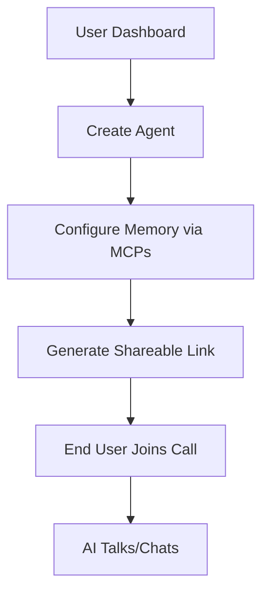
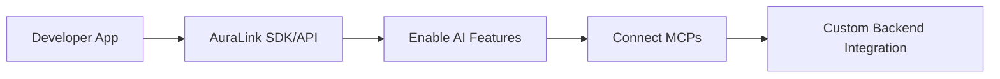

# AuraLinkRTC: Revolutionizing Intelligent Real-Time Communication

> **AuraLinkRTC Inc.** - Proprietary WebRTC Platform with Cutting-Edge AI Integration. Empowering developers and enterprises with seamless, AI-enhanced communication solutions. Not open source—enterprise-grade, closed-source excellence.

---

## 🎯 Vision & Overview

AuraLinkRTC is a proprietary SaaS platform designed for the next generation of real-time communication, blending WebRTC's power with advanced AI capabilities. Built for scalability, security, and ease-of-use, it handles the complexities of WebRTC and AI, allowing developers to integrate immersive features effortlessly. Whether building telemedicine apps, virtual classrooms, or AI-powered conferencing, AuraLinkRTC delivers reliable, intelligent experiences at scale.

**Key Differentiators**:

- Proprietary architecture (not open source) ensures innovation, support, and security without community dependencies.
- AI-first design for smarter interactions.
- Enterprise-ready with compliance, multi-region deployment, and 99.9% uptime.
- **AuraLink AIC Protocol (Premium)**: Optional AI-driven WebRTC compression reducing bandwidth by 80% for 4K on low-BW networks. Enable/disable via API keys (+20% cost). Integrated with agents for seamless real-time responses.

---

## 🌐 WebRTC Core Features

AuraLinkRTC's WebRTC foundation, forked from LiveKit, provides robust media handling:

- **Scalable SFU (Selective Forwarding Unit)**: Routes streams efficiently, supporting 10,000+ concurrent users with <100ms latency.
- **Cross-Platform Support**: SDKs for JavaScript/TypeScript, Swift (iOS), Kotlin (Android), Flutter, React Native, Rust, Unity.
- **End-to-End Encryption**: DTLS/SRTP for secure, GDPR/HIPAA-compliant communications.
- **Adaptive Quality**: Auto-adjusts bitrate based on network; monitors packet loss, jitter, RTT.
- **Multi-Region Clustering**: Redis-backed for global failover and load balancing.
- **TURN/STUN Servers**: Reliable NAT traversal for any network.
- **Screen Sharing & File Exchange**: Real-time sharing and uploads/downloads during calls.

---

## 🤖 AI Integration & Features

AuraLinkRTC integrates AI seamlessly for intelligent calls:

- **Real-Time Translation**: 10+ languages with context preservation for multi-language meetings.
- **Speech-to-Text (STT)**: Multiple provider options (e.g., Whisper, Google Speech-to-Text, Azure Cognitive Services) selectable in the dashboard for live transcription with noise cancellation; searchable archives.
- **Text-to-Speech (TTS)**: Multiple provider options (e.g., ElevenLabs, Google Cloud Text-to-Speech, Amazon Polly) selectable in the dashboard for natural speech generation with custom voices supported.
- **AI Moderation**: Real-time content filtering across media; customizable rules with oversight.
- **Summarization & Notes**: Auto-extracts key points, action items, and reports; generates follow-ups.
- **Voice Commands & Interaction**: AI-driven responses in calls for dynamic engagement.
- **BYOK Support**: Bring your own keys for OpenAI, ElevenLabs, etc., for customization.

---

## 📞 Calling Capabilities

Supports diverse calling experiences:

- **WhatsApp-Like 1:1 Calls**: Direct peer-to-peer audio/video with encryption and quality monitoring.
- **Discord-Type Open Rooms**: Scalable group calls (up to 1,000+ participants); public/private rooms with shareable links.
- **Group Conferencing**: Breakout rooms, participant management, and advanced features like screen sharing.
- **Shareable Links**: Click-to-join links where AI agents auto-launch and interact.
- **Recording & Streaming**: MP4/HLS exports; stream to YouTube/Twitch.
- **SIP/Telephony Integration**: AI voice bots on phone calls via Twilio.

---

## 🌐 Standalone User Experience

For non-technical users, AuraLinkRTC provides a complete standalone experience via our web dashboard. Users can:

- **Create AI Agents**: Build and customize agents with no coding required.
- **Generate Shareable Links**: One-click links for AI-enhanced calls; set expiration and access controls.
- **Embeddable Widgets**: Add call/agent interfaces to websites with copy-paste code.
- **Manage Everything**: View analytics, usage, and settings without backend integration.

This frontend is fully supported by our scalable backend APIs, ensuring reliability for all users.

---

## 🔗 Integration Options

Easy integration for developers and users:

- **API Keys**: Simple authentication for backend access; enable/disable features per key.
- **SDKs**: Pre-built libraries for rapid app integration—no WebRTC expertise needed.
- **Dashboard**: User-friendly web UI for managing API keys, agents, analytics, and toggles.
- **Webhooks**: Real-time event notifications (e.g., call start/end).
- **BYOK & MCPs**: Connect external memory/DBs or use built-in; MCP servers for knowledge enrichment.
- **Enterprise SSO**: SAML/OAuth integration for orgs.

---

## 🧠 AI Agents & Workflows

Programmable AI agents enhance calls:

- **Agent Creation**: Build in dashboard with custom prompts, behaviors (e.g., tutoring, support).
- **Workflows**: Auto-join rooms, respond contextually, summarize, or moderate.
- **Memory Integration**: Persistent context via MCPs for personalized interactions.
- **Real-Time Talkback**: Agents converse in calls, translate, or provide Q&A.
- **BYOK Agents**: Use custom LLMs for tailored experiences.
- **Multiple LLM Selection**: Provide options to select from hosted LLMs (e.g., GPT-4, Claude, Llama) or bring your own key (BYOK) for custom models, allowing users to choose which LLM hosts their agents for flexible, tailored performance.
- **Deployment Flexibility**: Deploy agents as shareable call links, website widgets, or API endpoints for backend integration.

---

## 💾 Memory & MCP Services

AuraLinkRTC's memory system provides unforgettable AI:

- **Built-in Memory**: Stores conversations, preferences; GDPR-compliant with user consent.
- **User-Friendly Connection**: Users connect external data sources (Google Drive, Notion, etc.) via MCPs directly in the dashboard—no coding required.
- **MCP Integrations**:
  - **Memory MCP**: Graph-based recall for fast, scalable knowledge.
  - **DeepWiki MCP**: Real-time GitHub/docs access for informed responses.
  - **Sequential-Thinking MCP**: Step-by-step reasoning in calls.
  - **Supabase MCP**: Live database queries for dynamic data.
- **Shared Memory**: Connect external DBs for cross-app context (optional BYOK).
- **Performance**: Sub-300ms recall, 70% cost savings vs. competitors.

---

## 🏢 Enterprise Features

Proprietary excellence for businesses:

- **Compliance & Security**: Audit logs, data retention, GDPR exports/deletions.
- **Analytics**: Real-time metrics on calls, AI usage, quality.
- **Scalability**: 99.9% uptime, global CDN, auto-scaling.
- **Admin Controls**: RBAC, SSO, rate limiting.
- **Pricing**: Subscription-based; free tier with premium AI features.

---

## 🏗️ Architecture & Communication Enhancements

To further strengthen inter-service communication and overall system reliability in our **5 microservices** (WebRTC Server, AI Core, Dashboard Service, Ingress/Egress, **Communication Service**), we recommend the following integrations:

### Communication Improvements

- **Adopt a Service Mesh**: Implement Istio or Linkerd for traffic management, including load balancing, circuit breakers, and observability (traces, metrics). This enhances fault tolerance and reduces manual handling.
- **Standardize APIs**: Use gRPC for internal calls where latency is critical, replacing REST for efficient real-time data exchange like media streams.
- **Event-Driven Architecture**: Expand Redis pub/sub to Kafka for scalable async events (e.g., AI analytics, call events), decoupling services and handling high volumes.
- **Security Hardening**: Enforce mTLS for all inter-service communication to ensure encrypted channels within the cluster.

### Operational Enhancements

- **Monitoring & Logging**: Integrate Prometheus/Grafana for centralized metrics on latency, error rates, and throughput. Add distributed tracing (Jaeger) for debugging bottlenecks.
- **Load Balancing & Scaling**: Deploy Kubernetes ingress controllers or API gateways (e.g., Kong) for external APIs, with horizontal pod autoscaling based on resource usage.
- **Testing**: Implement contract testing (e.g., Pact) for API interactions and chaos engineering (Litmus) to simulate network failures.

---

## 🗺️ Roadmap

**Q1 2025**:
- **Enhanced AI Moderation**: Improved content filtering and customizable rules.
- **Advanced Analytics**: Detailed insights on AI usage and call quality.

**Q2 2025**:
- **BYOK for All**: Bring your own keys for all AI services.
- **Expanded MCP Integrations**: More integrations for external data sources.

**Q3 2025**:
- **AI-Powered Customer Support**: AI-driven support bots for users.
- **Enhanced Security**: Additional security measures for enterprise compliance.

**Q4 2025**:
- **Next-Gen AI Agents**: More advanced AI agents with improved workflows.
- **Global Expansion**: Support for more languages and regions.

---

## 🚀 Getting Started

1. **Sign Up**: Create account on [auralinkrtc.com](https://auralinkrtc.com).
2. **Dashboard Setup**: Generate API keys, build agents, toggle features.
3. **Integrate**: Use SDKs/APIs in your app.
4. **Launch Calls**: Share links or embed in software.
5. **Scale**: Monitor via dashboard; upgrade for enterprise needs.

AuraLinkRTC: Where WebRTC meets AI intelligence. Proprietary, powerful, and ready for the future. 🌟

*© 2025 AuraLinkRTC Inc. All rights reserved.*
