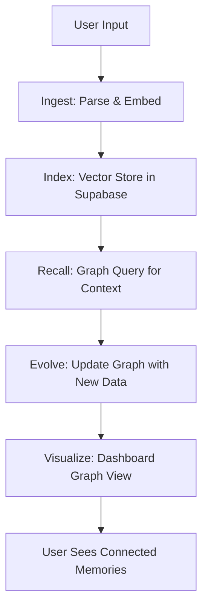

# Framework Tools for AuraLinkRTC Enterprise Backend

This document outlines the top 7 open-source tools selected for making AuraLinkRTC enterprise-grade. Each tool is evaluated for its usefulness in our microservices architecture (Go/Python, WebRTC, AI, Supabase, Kubernetes), with benefits, suitability examples, and integration diagrams. These tools enhance reliability, scalability, and AI capabilities for real-time communication at scale.

## Overall Architecture Integration

The tools integrate across our 4 microservices (WebRTC Server, AI Core, Dashboard, Ingress/Egress) for end-to-end enterprise workflows.

```mermaid
graph TB
    subgraph "AuraLinkRTC Microservices"
        W[WebRTC Server\n(Go)] -->|Streams| AI[AI Core\n(Python)]
        D[Dashboard\n(Go)] -->|Config| W
        D -->|UI| AI
        I[Ingress/Egress\n(Go)] -->|Media| W
    end

    subgraph "Orchestration & AI Tools"
        T[Temporal\n(Workflows)] -->|Durable Tasks| AI
        A[Argo Workflows\n(K8s Jobs)] -->|Scaling| T
        AF[Apache Airflow\n(DAGs)] -->|Scheduling| I
        P[Prefect\n(Dynamic Flows)] -->|Monitoring| AF
    end

    subgraph "AI Frameworks"
        LG[LangGraph\n(Agents)] -->|Reasoning| AI
        CR[CrewAI\n(Teams)] -->|Collaboration| LG
        AG[AutoGen\n(Multi-Agent)] -->|Conversations| CR
    end

    AI -->|Processed| W
    T -->|Orchestrates| AI
    LG -->|Enhances| AI
```

---

## 1. Temporal

### Description
Temporal is a durable workflow orchestration platform for long-running, fault-tolerant tasks in distributed systems. It uses Go/Python SDKs to manage stateful workflows with automatic retries and compensations.

### Usefulness
Temporal ensures reliable execution of complex AI and media processes in AuraLinkRTC, where tasks like AI summarization or call event processing might span multiple services and require persistence across failures.

### Benefits
- **Fault Tolerance**: Automatic retries and state recovery prevent data loss in real-time calls.
- **Scalability**: Handles high-volume workflows (e.g., 10,000+ users) without manual intervention.
- **Developer Productivity**: Reduces boilerplate code for error handling in Go/Python microservices.
- **Enterprise Compliance**: Built-in audit trails for GDPR/HIPAA.

### Suitability with Examples
- **Integration**: Use in AI Core for durable AI inference pipelines (e.g., translate → summarize → store in Supabase).
- **Example Workflow**:
  ```go
  // Go code in WebRTC Server
  workflow.ExecuteActivity(ctx, "ProcessCallSummary", callID)
  ```
  This retries if AI fails, ensuring summaries complete even during network issues.
- **Why Suited**: Complements Kubernetes for auto-scaling AI tasks in enterprise settings.

### Integration Diagram
```mermaid
graph LR
    A[User Joins Call] --> B[WebRTC Server Triggers Workflow]
    B --> C[Temporal Worker\n(Go/Python SDK)]
    C --> D[AI Core Executes\nSummarization Task]
    D --> E[Retry on Failure\n(e.g., Network)]
    E --> F[Store Result in\nSupabase]
    F --> G[Dashboard Displays\nAnalytics]
```

---

## 2. LangGraph

### Description
LangGraph is an extension of LangChain for building stateful, multi-step AI agents with graph-based workflows. It supports reasoning, tool use, and persistence in Python.

### Usefulness
LangGraph enables complex AI reasoning in AuraLinkRTC's AI Core, such as agents that retrieve memory, generate responses, and adapt in real-time calls.

### Benefits
- **State Management**: Tracks agent state across interactions for contextual AI.
- **Modularity**: Easy to chain tools (e.g., Supabase queries) with LLMs.
- **Debugging**: Visual graphs for troubleshooting AI failures.
- **Enterprise Security**: Integrates with RBAC for secure data access.

### Suitability with Examples
- **Integration**: Embed in AI Core for moderated calls (e.g., agent retrieves user memory from MCPs).
- **Example**:
  ```python
  # Python in AI Core
  graph = StateGraph(AgentState)
  graph.add_node("retrieve_memory", retrieve_memory)
  graph.add_node("generate_response", generate_response)
  ```
  Creates a graph for AI agents to reason step-by-step.
- **Why Suited**: Enhances BYOK LLMs with traceable workflows.

### Integration Diagram
```mermaid
graph TD
    A[User Input in Call] --> B[LangGraph Agent\n(Python)]
    B --> C[Node: Retrieve\nMemory (Supabase)]
    C --> D[Node: Reason\n(LLM via OpenAI)]
    D --> E[Node: Respond\n(TTS/ElevenLabs)]
    E --> F[WebRTC Server\nOutputs Audio]
```

---

## 3. CrewAI

### Description
CrewAI is a framework for orchestrating role-based AI agent teams that collaborate on tasks, with tools for planning, execution, and feedback loops.

### Usefulness
CrewAI allows multiple AI agents to work together in AuraLinkRTC, such as a translator agent collaborating with a moderator in group calls.

### Benefits
- **Collaboration**: Agents share context for better outcomes.
- **Flexibility**: Role-based (e.g., "Tutor" vs. "Moderator") for custom enterprise scenarios.
- **Efficiency**: Reduces single-agent overload in complex interactions.
- **Open Source**: Easy customization for proprietary features.

### Suitability with Examples
- **Integration**: Use in Dashboard for generating shareable AI links with agent teams.
- **Example**:
  ```python
  # Python in AI Core
  crew = Crew(agents=[tutor_agent, moderator_agent], tasks=[teach_task, moderate_task])
  ```
  Agents collaborate on virtual classroom calls.
- **Why Suited**: Fits multi-user WebRTC rooms with AI oversight.

### Integration Diagram
```mermaid
graph TD
    A[Group Call Starts] --> B[CrewAI Orchestrator\n(Python)]
    B --> C[Tutor Agent\n(Explains Topic)]
    C --> D[Moderator Agent\n(Filters Content)]
    D --> E[Collaborate on\nResponse]
    E --> F[WebRTC Streams\nto Users]
```

---

## 4. Apache Airflow

### Description
Apache Airflow is a Python-based platform for authoring, scheduling, and monitoring workflows as DAGs (Directed Acyclic Graphs).

### Usefulness
Airflow schedules and monitors AI/ML pipelines in AuraLinkRTC, such as periodic analytics or data ingestion from call recordings.

### Benefits
- **Scheduling**: Automated DAGs for batch AI tasks.
- **Monitoring**: Rich UI for tracking failures in enterprise ops.
- **Extensibility**: Integrates with Kubernetes for scaling.
- **Community**: Vast plugins for Supabase/Redis.

### Suitability with Examples
- **Integration**: Use in Ingress/Egress for processing recordings (e.g., upload → analyze → store).
- **Example DAG**:
  ```python
  # Python DAG
  extract_audio = BashOperator(task_id='extract', bash_command='ffmpeg ...')
  analyze_sentiment = PythonOperator(task_id='analyze', python_callable=analyze_ai)
  ```
  Runs post-call analytics reliably.
- **Why Suited**: Handles scheduled tasks without blocking real-time calls.

### Integration Diagram
```mermaid
graph TD
    A[Call Ends] --> B[Ingress/Egress\nUploads Recording]
    B --> C[Airflow DAG\n(Python Scheduler)]
    C --> D[Task: Extract Audio\n(FFmpeg)]
    D --> E[Task: AI Analysis\n(Python Script)]
    E --> F[Store in Supabase\n(Analytics)]
```

---

## 5. Prefect

### Description
Prefect is a modern workflow orchestration tool in Python, focused on dynamic flows, observability, and ease of use compared to Airflow.

### Usefulness
Prefect manages adaptive AI workflows in AuraLinkRTC, adapting to real-time data (e.g., call quality) for dynamic processing.

### Benefits
- **Dynamic Flows**: Adjust workflows based on runtime conditions.
- **Observability**: Better logging and dashboards for AI debugging.
- **Python-Native**: Seamless with AI Core scripts.
- **Scalability**: Cloud-ready for enterprise growth.

### Suitability with Examples
- **Integration**: Use for AI retry logic in AI Core (e.g., if LLM fails, switch models).
- **Example**:
  ```python
  # Python in AI Core
  @flow
  def ai_pipeline(data):
      result = process_data(data)
      if result.error:
          return retry_task(result)
  ```
  Handles failures gracefully in calls.
- **Why Suited**: More flexible than static DAGs for AI variability.

### Integration Diagram
```mermaid
graph TD
    A[AI Task Starts\n(e.g., Translation)] --> B[Prefect Flow\n(Python)]
    B --> C[Check Condition\n(e.g., Model Available)]
    C --> D[Execute Task\n(Success Path)]
    D --> E[Retry/Adapt\n(Failure Path)]
    E --> F[Output to\nWebRTC]
```

---

## 6. AutoGen

### Description
AutoGen is Microsoft's open-source framework for multi-agent conversations, code generation, and collaborative AI in Python.

### Usefulness
AutoGen enables agents to "talk" and solve problems together in AuraLinkRTC, like agents discussing call moderation strategies.

### Benefits
- **Conversational AI**: Agents debate and refine outputs.
- **Code Execution**: Generate and run code for dynamic features.
- **Error Handling**: Robust logging for production.
- **Enterprise Ready**: Azure integration for scale.

### Suitability with Examples
- **Integration**: Embed in AI Core for multi-agent Q&A in calls.
- **Example**:
  ```python
  # Python
  agents = [planner_agent, executor_agent]
  chat = GroupChat(agents, messages)
  ```
  Agents collaborate on complex responses.
- **Why Suited**: Fits Discord-like rooms with AI debates.

### Integration Diagram
```mermaid
graph TD
    A[User Query in Call] --> B[AutoGen GroupChat\n(Python)]
    B --> C[Planner Agent\n(Plans Response)]
    C --> D[Executor Agent\n(Generates Code/Output)]
    D --> E[Collaborate/Refine]
    E --> F[Final Output\nto User]
```

---

## 7. Argo Workflows

### Description
Argo Workflows is a Kubernetes-native workflow engine for running parallel jobs as CRDs (Custom Resource Definitions).

### Usefulness
Argo runs containerized AI tasks in AuraLinkRTC, leveraging Kubernetes for scaling and resource management.

### Benefits
- **Kubernetes Integration**: Native scaling with pods.
- **Parallelism**: Handle multiple AI jobs simultaneously.
- **Fault Tolerance**: Restart failed workflows automatically.
- **Cost-Effective**: No extra infrastructure needed.

### Suitability with Examples
- **Integration**: Use for batch AI processing (e.g., analyze multiple recordings).
- **Example YAML**:
  ```yaml
  apiVersion: argoproj.io/v1alpha1
  kind: Workflow
  spec:
    templates:
    - name: ai-task
      script:
        image: python:3.9
        command: [python, analyze.py]
  ```
  Scales AI tasks in K8s.
- **Why Suited**: Ties into your existing deployment for seamless ops.

### Integration Diagram
```mermaid
graph TD
    A[Trigger from\nDashboard] --> B[Argo Workflow\n(K8s CRD)]
    B --> C[Pod: AI Analysis\n(Container)]
    C --> D[Parallel Tasks\n(e.g., Multiple Calls)]
    D --> E[Store Results\n(Supabase)]
    E --> F[Scale Pods\n(Auto)]
```

---

## 💾 Memory & MCP Services

AuraLinkRTC's memory system provides unforgettable AI:

- **Built-in Memory**: Stores conversations, preferences; GDPR-compliant with user consent.
- **User-Friendly Connection**: Users connect external data sources (Google Drive, Notion, etc.) via MCPs directly in the dashboard—no coding required.
- **MCP Integrations**:
  - **Memory MCP**: Graph-based recall for fast, scalable knowledge.
  - **DeepWiki MCP**: Real-time GitHub/docs access for informed responses.
  - **Sequential-Thinking MCP**: Step-by-step reasoning in calls.
  - **Supabase MCP**: Live database queries for dynamic data.
- **Shared Memory**: Connect external DBs for cross-app context (optional BYOK).
- **Performance**: Sub-300ms recall, 70% cost savings vs. competitors.
- **Visual Memory Graph**: Users view stored memories as an interactive graph in the dashboard, showing connections (e.g., conversation nodes linked to preferences).



---

## Summary
These tools collectively elevate AuraLinkRTC to enterprise-grade by providing durable workflows (Temporal, Prefect, Airflow, Argo), advanced AI (LangGraph, CrewAI, AutoGen), and seamless integration. Start with Temporal and LangGraph for immediate impact. For questions or code samples, refer to official docs linked in each section.
