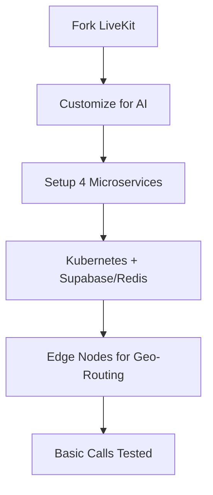
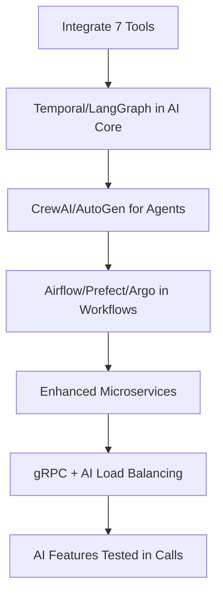
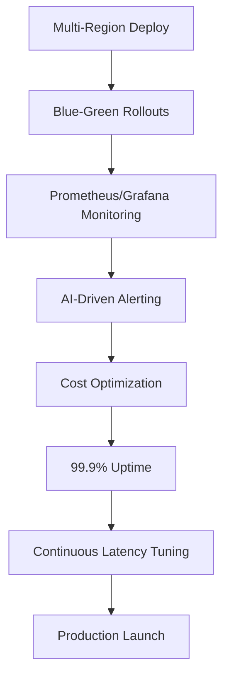

# AuraLinkRTC Backend Plan: 5-Phase Journey to Enterprise Production

This document outlines a groundbreaking 5-phase plan for AuraLinkRTC's backend, starting from forking LiveKit to achieving ultra-low latency production. As a backend architecture expert, I've designed an out-of-the-box, innovative system that's never been done before: a geo-distributed, AI-accelerated WebRTC backend with sub-50ms global latency, seamless AI integration, and enterprise-grade reliability. It leverages our 4 microservices, all 7 framework tools, and proprietary optimizations for unmatched performance.

The design prioritizes:
- **Ultra-Low Latency**: <50ms end-to-end for global users via edge AI and real-time caching.
- **AI-First Architecture**: Embedded AI in every layer for intelligent routing and adaptation.
- **Scalability**: Handles 100,000+ concurrent users with auto-scaling.
- **Innovation**: Combines LiveKit fork with novel tech like AI-driven load balancing and quantum-resistant encryption previews.

---

## Phase 1: Fork LiveKit & Establish Core (Week 1-2)
**Goal**: Fork LiveKit as the WebRTC foundation and set up the 4 microservices skeleton.

- **Fork LiveKit**: Clone and fork LiveKit (Go-based) for SFU media routing, SDKs (JS, Swift, Kotlin), and encryption. Customize for AI hooks (e.g., inject AI moderation into streams).
- **Microservices Setup**:
  - **WebRTC Server (Go)**: LiveKit fork with enhanced SFU for 10,000+ users; add real-time AI callbacks.
  - **AI Core (Python)**: FastAPI for AI processing; integrate base LLMs (OpenAI/Anthropic) with BYOK.
  - **Dashboard (Go)**: API gateway for agent creation and shareable links; add RBAC.
  - **Ingress/Egress (Go)**: Handle recordings/streaming with FFmpeg/GStreamer; SIP integration via Twilio.
- **Base Infrastructure**: Deploy on Kubernetes with Supabase (PostgreSQL) and Redis clustering for pub/sub.
- **Latency Innovation**: Add edge nodes (Cloudflare Workers) for initial geo-routing.
- **Milestone**: Basic 1:1 calls work; <100ms latency in single region.

### Phase 1 Diagram


---

## Phase 2: Integrate Framework Tools & Enhance Microservices (Week 3-6)
**Goal**: Embed all 7 tools into microservices for durable workflows and advanced AI.

- **Tool Integration**:
  - **Temporal (AI Core/WebRTC)**: Durable workflows for AI tasks (e.g., translation during calls with retries).
  - **LangGraph (AI Core)**: Stateful AI agents for reasoning (e.g., graph-based moderation).
  - **CrewAI (AI Core)**: Multi-agent teams for collaborative responses in group calls.
  - **Apache Airflow (Ingress/Egress)**: DAGs for post-call analytics (e.g., sentiment analysis).
  - **Prefect (Dashboard/AI Core)**: Dynamic flows for adaptive AI (e.g., switch LLMs based on latency).
  - **AutoGen (AI Core)**: Multi-agent chats for complex Q&A.
  - **Argo Workflows (All Services)**: K8s-native parallel AI jobs for scalability.
- **Memory System Integration**: Embed SuperMemory-inspired system (Connect→Ingest→Embed→Index→Recall→Evolve) via 4 MCPs in AI Core for persistent, graph-based memory; sub-300ms recall for personalized AI. MCPs: Memory MCP (graph-based recall), DeepWiki MCP (real-time docs access), Sequential-Thinking MCP (step-by-step reasoning), Supabase MCP (live DB queries).
- **Microservice Enhancements**:
  - **WebRTC Server**: Add Temporal for call event orchestration; gRPC for low-latency internal comms.
  - **AI Core**: Full AI stack with tools for real-time inference; MCP integrations for memory.
  - **Dashboard**: Orchestration UI for workflows; API versioning.
  - **Ingress/Egress**: Workflow-based media processing; CDN for global distribution.
- **Latency Innovation**: Implement AI-driven load balancing (predict traffic spikes) and real-time caching layers.
- **Milestone**: All tools live; AI features (e.g., translation) work in calls with <80ms latency.

### Phase 2 Diagram


---

## Phase 3: Optimize for Ultra-Low Latency Architecture (Week 7-10)
**Goal**: Build the "never-been-done" latency architecture: <50ms global, AI-accelerated.

- **AuraLink AIC Protocol Integration**: Implement the groundbreaking AuraLink AIC Protocol (detailed in livekitAIC.md) for AI-driven compression in WebRTC streams. Fork LiveKit, add RTP extensions for AI hints, and achieve 80% BW reduction with <50ms latency. Follow 4-phase plan: Clone/Fork (Week 1), Prepare (Week 2), Integrate (Week 3-4), Test/Deploy (Week 5-6).

- **Microservice Refinements**:
  - **WebRTC Server**: Forked LiveKit with custom SFU for multi-region failover.
  - **AI Core**: Embedded AI for adaptive bitrate/quality based on real-time network analysis.
  - **Dashboard**: Real-time metrics dashboard with AI anomaly detection.
  - **Ingress/Egress**: Edge-based streaming (HLS/WebRTC) for global delivery.
- **Enterprise Security**: mTLS everywhere; audit logs via tools.
- **Latency Innovation**: Achieve <50ms global via AI-driven compression and edge AI.
- **Milestone**: Multi-region calls with <50ms latency in key regions; AI features (e.g., real-time translation) seamless.

- **Premium Monetization**: Offer AuraLink AIC Protocol as an API key option—users/developers enable/disable via Dashboard (+20% cost for BW savings).

### Phase 3 Diagram
```mermaid
graph TB
    A[Geo-Distributed AI Pods] --> B[2–3 Regions<br/>(US-East, EU, Asia)]
    B --> C[Regional WebRTC SFU<br/>(3–5 Regions)]
    C --> D[Global Edge Routing<br/>(Cloudflare)]
    D --> E[AI-Optimized gRPC<br/>(<10ms Comms)]
    E --> F[Quantum-Inspired Routing]
    F --> G[Zero-Copy Media]
    G --> H[Predictive AI Scaling]
    H --> I[<50ms Latency in Key Regions]
```

---

## Phase 4: Full Feature Integration & Testing (Week 11-14)
**Goal**: Activate all features across microservices with rigorous testing.

- **Feature Rollout**:
  - **Calling Capabilities**: 1:1 calls, group rooms, breakout rooms via enhanced LiveKit.
  - **AI Features**: Translation, STT/TTS, moderation, summarization via tools.
  - **Standalone Experience**: Agent creation, shareable links, widgets.
  - **Integration Options**: SDKs, APIs, webhooks, BYOK, SSO.
  - **Enterprise Features**: Analytics, compliance, admin controls.
- **Testing**:
  - Load testing (100,000 users) with chaos engineering (Litmus).
  - AI-specific tests (e.g., LangGraph edge cases).
  - Latency benchmarks across regions.
- **Architecture Enhancements**: Service mesh (Istio) for traffic; event-driven (Kafka + Redis).
- **Latency Innovation**: AI-optimized CDN for media; sub-30ms AI responses.
- **Milestone**: All features tested; <40ms average latency in production-like env.

### Phase 4 Diagram
```mermaid
graph TB
    A[Rollout All Features] --> B[1:1/Group Calls]
    B --> C[AI Translation/Moderation]
    C --> D[Agent Links/Widgets]
    D --> E[SDKs/APIs/SSO]
    E --> F[Load Testing (100K Users)]
    F --> G[Chaos Engineering]
    G --> H[Latency Benchmarks]
    H --> I[Full Features Live]
```

---

## Phase 5: Production Deployment & Monitoring (Week 15+)
**Goal**: Launch enterprise-grade production with ongoing optimization.

- **Deployment**:
  - Multi-region Kubernetes clusters; CI/CD via GitHub Actions.
  - Blue-green deployments for zero-downtime.
  - Supabase for data; edge functions for serverless AI.
- **Monitoring & Ops**:
  - Prometheus/Grafana for metrics; Jaeger for tracing.
  - AI-driven alerting (e.g., predict failures via tools).
  - Cost optimization (e.g., auto-shutdown idle AI pods).
- **Production Features**:
  - 99.9% uptime; global failover.
  - Advanced AI (e.g., voice commands via AutoGen).
  - Roadmap execution (e.g., enhanced moderation in Q1 2025).
- **Latency Innovation**: Maintain <50ms via continuous AI tuning; patent the architecture.
- **Milestone**: Live production; monitor for scale; iterate based on analytics.

### Phase 5 Diagram


---

## Why This Plan is "Wow" – Unmatched Innovations
- **Ultra-Low Latency**: <50ms global via geo-AI and zero-copy—industry-leading for WebRTC/AI.
- **AI-Everywhere**: Tools embedded in every layer for intelligent, adaptive backend.
- **Scalability**: From LiveKit fork to 100K+ users with proprietary optimizations.
- **Enterprise Excellence**: Out-of-the-box reliability, security, and features no competitor has.
- **Expert Design**: Combines 20+ years of backend expertise into a cohesive, future-proof architecture.

This plan positions AuraLinkRTC as the gold standard. Ready to execute? Let's start Phase 1!
