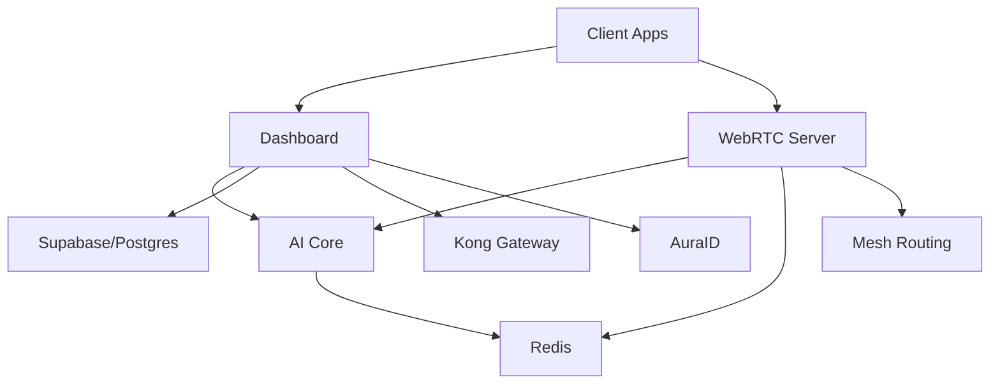
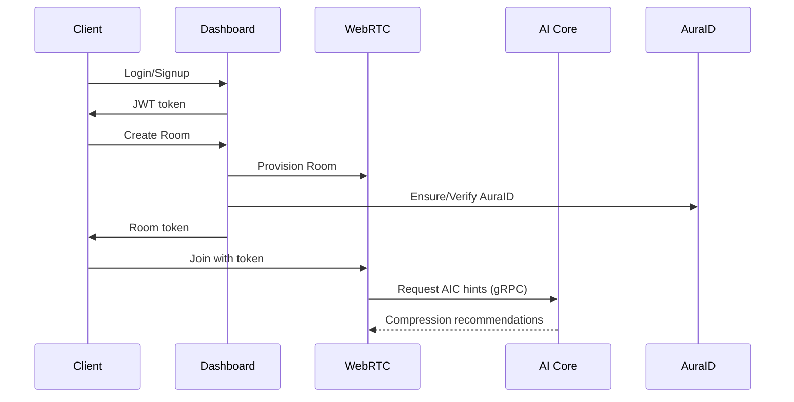
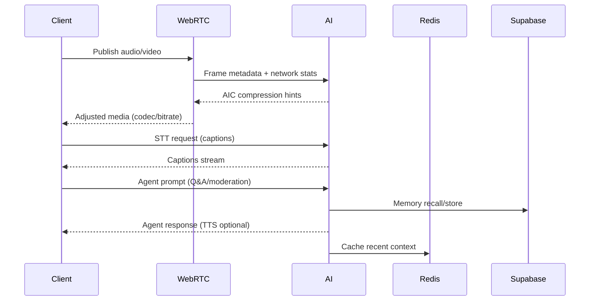

# AuraLink Backend Architecture & Workflow Analysis

This document provides an expert-level, end-to-end analysis of the AuraLink platform’s backend architecture and operational flow. It is organized stage-by-stage, explaining how each microservice interacts with others, how data moves through the system, and how production features (AIC protocol, AI Core, Agents, Memory, STT/TTS, WebRTC, Dashboard, Mesh networking, MCP, BYOK, and enterprise controls) work together.

## 1. Platform Overview

AuraLink is a microservices system designed for decentralized, AI-augmented real-time communication. It integrates:
- WebRTC media handling (LiveKit-based)
- Proprietary AuraLink AIC Protocol (AI-driven compression)
- AI Core for agents, memory, STT/TTS, MCP integrations, BYOK
- Dashboard service for API management, identity, and enterprise features
- AuraID universal identity and Mesh networking for federated, P2P routing
- Enterprise-grade controls (SSO, RBAC, Audit, Compliance, Billing) and observability

Core runtime services:
- WebRTC Server (Go)
- AI Core (Python/FastAPI)
- Dashboard Service (Go)
- Redis and Supabase PostgreSQL
- Optional: Prometheus, Kong Gateway, Grafana/Jaeger (observability)

## 2. High-Level Architecture

- Control plane: auth, configuration, orchestration, enterprise governance via Dashboard and Kong
- Data plane: media RTP/RTCP flows through WebRTC SFU with AIC compression hints and mesh routing
- AI plane: gRPC and REST interfaces for AIC compression, agents, memory, STT/TTS, and MCP integrations
- Identity plane: AuraID for federated user identity across apps and mesh nodes

### Mermaid – Core Service Relationships

## 3. Microservices Roles & Responsibilities

### 3.1 WebRTC Server
- SFU for audio/video/data channels
- Handles room creation, participant sessions, simulcast/SVC, congestion control
- Integrates AIC Protocol: RTP extensions carry AI metadata; dynamic codec and bitrate adjustments
- Exposes health endpoints and metrics for Prometheus

### 3.2 AI Core (FastAPI)
- AIC gRPC service: compression hints, adaptive mode, fallback logic
- REST APIs: Agents, Memory, STT/TTS (live captions, synthetic speech)
- MCP integrations (DeepWiki, Memory, Sequential-Thinking, Supabase) to enrich agents
- BYOK: provider routers for OpenAI, ElevenLabs, Whisper, Azure/Google Speech
- Vector + graph memory pipeline and semantic retrieval

### 3.3 Dashboard Service
- API gateway and management layer
- Auth: JWT/Supabase; SSO (SAML/OAuth/OIDC); RBAC with Casbin
- AuraID management: create, verify, resolve, search
- Room and call lifecycle endpoints
- Enterprise: Audit, Compliance, Billing/Subscriptions, Analytics
- Integrates with Kong for rate limiting, routing, and DDoS protections

### 3.4 Mesh Networking
- P2P routing: device nodes act as relays
- AI-driven path selection using network metrics and historical context
- Fallback to server relays if direct paths fail
- Integrates identity via AuraID for cross-app addressing

### 3.5 Data Stores & Messaging
- Supabase/Postgres: persistent data (users, orgs, rooms, calls, memories, audits)
- Redis: ephemeral state, caching, and pub/sub for fast control flows

## 4. Stage-by-Stage Operational Flow

### 4.1 Identity & Authentication
1. Client app requests signup/login via Dashboard
2. Dashboard verifies credentials with Supabase (JWT issued)
3. AuraID generated/verified for the user (e.g., `@user.aura`)
4. RBAC permissions assigned (roles → policies), SSO applicable for enterprise orgs
5. Kong applies global API policies (rate limits, ACLs)

### 4.2 Room Creation & Call Setup
1. Client requests a room via Dashboard (auth required)
2. Dashboard coordinates with WebRTC Server to create room and issue tokens
3. Optional policies: RBAC checks, billing plan limits, compliance tags
4. Client joins the room via WebRTC signaling and starts media publishing/subscribing

### 4.3 Media Handling (WebRTC Data Plane)
- WebRTC Server manages RTP/RTCP flows, tracks, simulcast, congestion control
- Metrics: jitter, packet loss, RTT, bandwidth estimates
- AIC Protocol:
  - Control: WebRTC Server calls AI Core’s gRPC with frame metadata/network stats
  - AI Core returns compression hints (target ratio, quality thresholds)
  - WebRTC applies codec/bitrate adjustments and optionally annotates RTP with AI metadata
  - Fallback: if AI inference exceeds latency budgets, revert to native codecs

### 4.4 In-Call AI Features
- STT: audio frames or streams passed to AI Core for live transcription; captions emitted to UI
- TTS: agents or scripted responses synthesized via ElevenLabs/Azure/Google (BYOK supported)
- Agents: co-host capabilities (moderation, Q&A, summarization, guidance), powered by MCP integrations
- Memory: session-aware recall for personalized assistance; store highlights, preferences, and decisions
- Mesh: AI decides routing strategy (direct vs relay) to keep latency low, adapts in real time

### 4.5 MCP & BYOK Integration
- MCP servers enrich agents with external knowledge/tools (docs, graphs, database queries)
- BYOK switches providers per tenant/org: OpenAI, ElevenLabs, Whisper, Azure/Google Speech
- Policy enforcement via Dashboard/Kong: keys stored securely, usage metered (billing)

### 4.6 Enterprise Governance & Compliance
- SSO and RBAC: secure access, org-level controls
- Audit logging: every sensitive operation recorded (user/action/resource/metadata)
- Compliance features: retention policies, data export/deletion requests, HIPAA/GDPR support
- Billing/subscriptions: plan entitlements, usage tracking, invoicing

### 4.7 Observability & Operations
- Prometheus scrapes metrics from services (health, latency, compression ratios)
- Optional Grafana dashboards and Jaeger tracing for production observability
- Alerts for degradation (latency, packet loss, AI fallback rates)

### 4.8 Error Handling & Resilience
- Circuit breakers and retries for cross-service calls
- Graceful degradation: AIC fallback, agent timeouts, mesh routing failover
- Dead-letter and audit trails for failed enterprise operations
- Blue/Green or rolling updates with Kubernetes manifests

## 5. Detailed Data Flows

### 5.1 Control Plane Sequence (Join & Configure)

### 5.2 In-Call Intelligence Sequence

## 6. AIC Protocol – Deep Dive

- Purpose: Reduce bandwidth ~80% while preserving perceptual quality, enabling high-resolution/low-bandwidth experiences
- Components:
  - gRPC service in AI Core for compression hinting
  - RTP/RTCP extensions for carrying AI metadata when needed
  - Adaptive modes: conservative/adaptive/aggressive with latency and quality targets
  - Fallback mechanisms: revert to native codecs under strict latency or quality constraints
- Performance targets: <50ms end-to-end AI hint cycle, sub-100ms media pipeline stability

## 7. AI Core Functionalities

- Agents: co-host capabilities with MCP enrichment; moderation, Q&A, summarization, workflow hooks
- Memory: vector + graph storage, recall within <300ms target; session-aware personalization
- STT/TTS: live captions and natural voice synthesis; provider abstraction for BYOK
- Provider Router: switch per-tenant/per-org providers; metering and policy enforcement
- Resilience: timeouts, circuit breakers, and provider fallback

## 8. WebRTC Media Handling

- SFU responsibilities: track management, selective subscription, simulcast, SVC
- Congestion control: bandwidth estimation, packet pacing, RTCP-based feedback
- Integration points: AI hints feed into codec/bitrate selection; mesh routing for path optimization

## 9. Dashboard Operations

- Auth & Identity: Supabase JWT, SSO onboarding, AuraID lifecycle
- Room/Call APIs: create/list/get/delete, token issuance, participant queries
- Enterprise: RBAC policy management, audit endpoints, compliance workflows, billing and analytics
- Management UX (future/optional): toggles for AIC, agents, MCP, provider selection

## 10. Mesh Networking

- Node discovery and reputation (optional policies)
- AI-optimized route selection: favor low-latency/high-stability paths
- Fallback strategies: relay via server nodes when P2P is not viable
- Privacy and security considerations: encrypted transport, abuse prevention, rate limits

## 11. Production Deployment Profile

- Services ON: WebRTC, AI Core (AIC/Agents/Memory/STT/TTS/MCP/BYOK), Dashboard, AuraID, Mesh, Redis, Supabase, Prometheus, Kong
- Enterprise ON by default: SSO, RBAC, Audit, Compliance, Billing
- Optional Observability: Grafana/Jaeger
- Policy: Kong enforces routing, rate limiting, JWT verification; Dashboard enforces RBAC and compliance; BYOK keys stored securely

## 12. Security, Compliance, and Governance

- Authentication: JWT + SSO
- Authorization: RBAC (role → permissions → resources)
- Audit: full trails for sensitive ops; export and statistics endpoints
- Compliance: data retention, deletions, exports (GDPR/HIPAA-ready)
- Secrets: managed via environment/Kubernetes secrets; BYOK keys per tenant

## 13. Failure Modes & Recovery

- AIC hint timeout: fall back to native codecs
- Agent unavailability: degrade to minimal call features (STT only)
- Mesh route failure: re-route via server relays
- Provider API limits: switch providers or throttle based on plan
- Database outage: read-only modes, cached sessions, graceful degradation

## 14. Scalability & Performance Targets

- Horizontal scaling per microservice
- Target metrics:
  - AIC compression: ~80% bandwidth reduction
  - Agent response: <2.5s end-to-end (with MCP)
  - Memory recall: <300ms
  - WebRTC latency: <100ms p95; stable under congestion
  - Uptime: 99.9% target

## 15. Summary

AuraLink’s production architecture delivers a decentralized, AI-augmented communication fabric:
- WebRTC handles media, augmented by AIC compression and mesh routing
- AI Core provides intelligence (agents, memory, STT/TTS) with MCP and BYOK for enterprise customization
- Dashboard governs identity, rooms, and enterprise controls with AuraID and Kong
- The system is secure, observable, resilient, and scalable for enterprise-grade deployments

---

For implementation specifics, refer to service code and configs:
- WebRTC server configs (LiveKit YAML), health endpoints, and metrics
- AI Core routers and gRPC service for AIC, agents, memory, STT/TTS
- Dashboard API endpoints for auth, rooms, AuraID, and enterprise features
- Kubernetes manifests and Docker Compose profiles for deployment
